# tailnet-byok

**An Android client for your own DSH server, reached over Tailscale.** A long job runs
on your desktop, you have to leave, and you would rather keep the session in your hand
than sit and watch it. That is the one thing this app does: it is the client.

**Install it on both ends** — it is used **together with** this app, not replaced by it —
and sign both into the **same** tailnet. Your DSH then answers at an address inside that
tailnet; paste it, sign in, and the app talks to that one service and nothing else.

| End | What to install | Where to get it |
|---|---|---|
| The computer running DSH | Tailscale | <https://tailscale.com/download> |
| The phone or tablet | the official **Tailscale for Android** app, `com.tailscale.ipn` | **Google Play** ([listing](https://play.google.com/store/apps/details?id=com.tailscale.ipn)) — or the APK itself from Tailscale's own package server: <https://pkgs.tailscale.com/stable/#android> |

Take the Play Store build if you can: that is where new Android versions land first. The
package server is the only official place that hands you a **file**, and that APK does not
update itself. Tailscale's GitHub releases page is *not* the Android distribution channel
and lags behind it. The maintainer runs **Tailscale for Android 1.103.90** (© 2024 Tailscale
Inc., package `com.tailscale.ipn` — it is their app, not ours).

**Android version: 8 or later, which is what Tailscale itself requires** — and it is
verified working on **Android 12** (HUAWEI AGS5-W00 tablet) and **Android 14** (HONOR
ALT-AN00 phone). Old devices carry old WebViews, and the DSH interface is where that shows,
so if the page looks wrong on an old phone, suspect the engine first. No account with us, no
server of ours, no shared relay.

> **What this project does not provide:** a tailnet, a node, a server, a key, or a relay.
> It is a client. The **[official Tailscale app](https://tailscale.com/download) is what
> puts the device on the tailnet** — install it on both ends, signed into the same tailnet;
> it is used **together with** this app, not replaced by it. An earlier version of this page
> said the app "carries its own Tailscale node", which read as if the node came from us; it
> does not. `tailnet-byok` does contain an optional *embedded node* mode
> ([docs/TSNET.md](docs/TSNET.md)) that dials from inside the app with **your own** Tailscale
> auth key — that is what "BYOK" in the name refers to — while the path the maintainer tests
> with is the system network and the official app. **That is the whole scope:** one job, done
> plainly — there is nothing to install into DSH, no mobile protocol of its own, no tunnel
> service, no account, no relay.

> Bring-your-own-key, taken literally: the key is a Tailscale auth key, it is
> stored encrypted by the Android Keystore, and it never leaves your device
> except to the control plane you configure.

[](https://github.com/zero6689/tailnet-byok/actions/workflows/ci.yml)
[](https://zero6689.github.io/tailnet-byok/)
[](LICENSE)
[-3DDC97.svg)](https://developer.android.com/about/versions/oreo)

**[Download the latest APK](https://github.com/zero6689/tailnet-byok/releases/latest/download/tailnet-byok-arm64.apk)**
([mirror](https://zero6689.github.io/tailnet-byok/byok/tailnet-byok-arm64.apk) — the same bytes from a different
host; use it if the GitHub link crawls, which it does from some networks)
— Android 8.0+, arm64. The releases page keeps one build, the one above; earlier ones are
withdrawn rather than left beside it, because two entries that report the same version cannot be
told apart once they are installed. Then open the app: a fresh install shows the ways to connect it. The short
version is that whoever runs the server you are reaching hands over a target, and
[the provisioning page](https://zero6689.github.io/tailnet-byok/provisioning.html) is what turns
that target into a link or a QR code. Install, take a link, sign in against your own server; nothing
here talks to a server of ours.

> **Not affiliated with DeepSeek.** This is an independent, unofficial client. The name and
> the whale artwork are used descriptively, to say what the app connects to. See
> [Not affiliated with DeepSeek](#not-affiliated-with-deepseek).

---

## Why this exists

A long job is running on my desktop — a build, a render, an agent session. I have to
leave. What I do not want is to be tied to the chair until it finishes, and what I do
not want to lose is the session itself: not a status mail, not a log tail, but the same
DSH conversation, still able to take the next instruction from a phone on the way out
the door.

That is the whole point of this project: **your DSH server keeps running on your own
machine, your own tailnet puts the two on the same private network, and this app is the
client that reaches it.** Leave the desk, keep the session. Phone or tablet, same
server, same session.

What that looks like in practice:

- **Reply in the same session** — the conversation on the phone is the one the desktop is
  running, not a copy, a summary or a read-only view.
- **Answer what DSH asks** — its questions and tool approvals arrive in your hand, so a job
  does not sit stalled until you are back at the desk to tap something.
- **Watch a long job finish** — output streams while you are elsewhere, background tasks
  included, so "is it done yet" stops requiring a chair.
- **Phone or tablet, one target** — both point at the same server and see the same thing.

Everything below in this section is about *how* that connection is made.

### How it connects, and why it asks for no VPN permission

The everyday setup is two apps: the **official Tailscale app** signs the device into your
tailnet, and `tailnet-byok` is only the DSH client on top of it. The app opens one
connection, to one destination, and nothing else — no auth key, no VPN slot of its own.

The other two ways to get a phone onto a tailnet in order to reach one service are both
unsatisfying, which is why the build also carries an optional third:

1. **Have the official app do the provisioning.** It works, and for most people it
   is the right answer — the official app is also what this project's own everyday
   mode runs on. But *no other app can hand it an auth key*: there is no API,
   intent or content provider for that. If your goal is "an app that puts a device
   on my tailnet from inside the app", this route cannot do it.
2. **Ship your own VPN service.** That means `BIND_VPN_SERVICE`, a foreground
   service, split-tunnel policy, and a permanent notification — a lot of
   surface, and a lot of ways to get it wrong, to open one socket to one host.

`tailnet-byok` therefore also carries a third option, as a **mode in the build rather
than a service**: it embeds a **userspace** Tailscale node with
[`tsnet`](https://pkg.go.dev/tailscale.com/tsnet) and dials the target through
it. The device's other traffic is untouched, and the app itself requests no VPN
permission — on the system-network path the tunnel belongs to the official app
instead. The app opens one connection, to one destination, and nothing else.

That third option is **optional**: the same build also runs on the device's existing
network, which is the mode used day to day and the one that needs no auth key. Nothing
here is a service you sign up for, and no node of it is ours.

The closest thing in the field is
[`GlassHaven/Haven`](https://github.com/GlassHaven/Haven) — `tsnet` bound through
gomobile into a Kotlin app, userspace netstack, no `VpnService` consent — applied
there to a general tunnel and here to the single-destination case. Haven is
AGPL-3.0, so it is worth reading as evidence that this shape works, and it is not
a source of code for an MIT project.

Two designs that look like the same shape are not: [`tailscale/tailvisor`](https://github.com/tailscale/tailvisor)
runs macOS and Linux guest VMs on Apple Silicon (Swift, `-buildmode=c-archive`) and
contains no Android code at all, and
[`netbirdio/android-client`](https://github.com/netbirdio/android-client) *does* take
the device-wide VPN slot — its `:tool` module declares a `VPNService` and holds
`BIND_VPN_SERVICE` — exactly the trade this project declines to make.

---

## What it does

- **Configuration** — Tailscale auth key, target host (MagicDNS name or `100.x`
  address), port, scheme, path, node hostname, and an optional self-hosted
  control server for headscale.
- **Secure storage** — the auth key is encrypted with an AES-256-GCM key that
  lives in the Android Keystore. On devices with a TEE or StrongBox, that key
  never exists in the app's address space at all.
- **Connection test** — a six-step check that names the step that failed, with
  timings, instead of returning one unhelpful boolean.
- **Direct connection** — traffic reaches the target over the tailnet, from
  inside the app.
- **The target's own UI** — *Open the DSH UI* renders the target's web interface in a
  WebView. It goes through a `127.0.0.1` reverse proxy inside the app, because the socket
  into your tailnet is created in Go and Android's HTTP stack has no route to it. The
  listener is loopback-only, requires a random per-session token, and its session cookie
  is cleared when you leave the screen.
- **Updates, verified or refused** — *Check for updates* reads `dsh.apk.version` from the
  update source (by default the target's origin, and configurable), downloads `dsh.apk` when
  that is newer, and installs it only when the bytes match `dsh.apk.sha256` and the archive
  declares this app's package name. There is no timer and no background check; the result of
  the last attempt stays on the screen, including after the installer restarts the app.
- **Provisioning by link or QR code** — a deployment can hand the app its address as
  `dshbyok://setup?target=…&mode=…`. The app shows what the link would change and waits for a
  tap; a link that carries a credential-shaped field is refused outright, and one pointing at a
  host the address policy rejects cannot be applied. There is a generator that renders the QR
  code in your browser: [`site/provisioning.html`](https://zero6689.github.io/tailnet-byok/provisioning.html).
  See [`docs/PROVISIONING.md`](docs/PROVISIONING.md).
- **A QR code in the app, both directions** — the settings screen draws this device's own
  configuration as a code another phone can scan, and scans a code with the camera (or reads one
  from a picture, with no camera permission at all). A scanned code is parsed and shown like any
  other link: it can never apply itself, and it can never carry a credential. See
  [`docs/SECURITY-MODEL.md`](docs/SECURITY-MODEL.md) for what the camera is and is not used for.

### A sample run

```
✓ Validate target address     target looks like a tailnet address
✓ Select connection method    using Embedded tailnet node
✓ Check stored credential     auth key present (fp:3f9a1c04)
✓ Bring up tailnet node       node up at 100.101.102.104 in phone.tailnet-name.ts.net   1840 ms
✓ Open TCP connection         connected in 142 ms (resolved to 100.101.102.103)          142 ms
✓ Send HTTP request           HTTP 200 in 187 ms                                      187 ms
Connected
```

And when it fails, it says which part:

```
✗ Validate target address     a public address is not reachable through a tailnet.
                              Use the 100.x address or the MagicDNS name.
```

---

## Screens

Both devices now run **0.4.6** (`versionCode` 26) — Android's own app-info screen is the first one below,
because it is the system's word for what is installed rather than the app's. The captures around it come
from the 0.4.x line as it grew, and all of them are from real devices rather than mockups. Screenshots that
showed a tailnet address — the provisioning page's target field, the link it generates, and the QR code that
encodes it — are redacted: that address belongs to whoever runs the server, not to this project.

| | | |
|---|---|---|
| 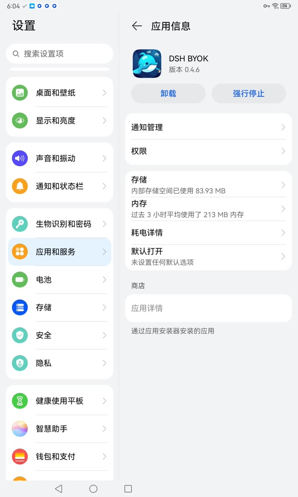 | 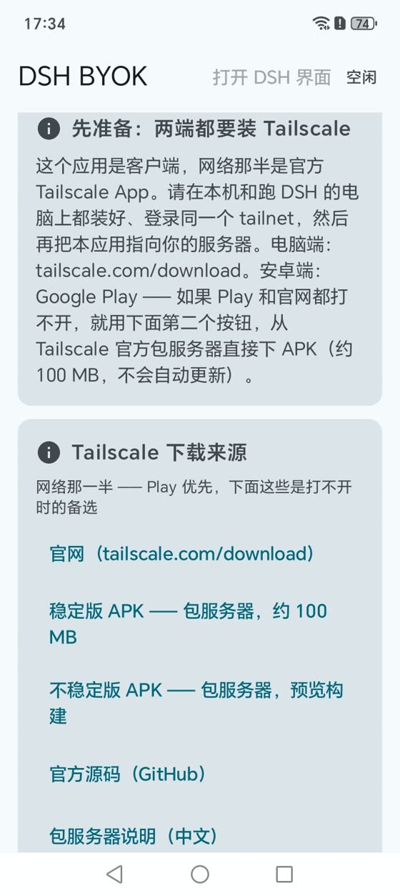 | 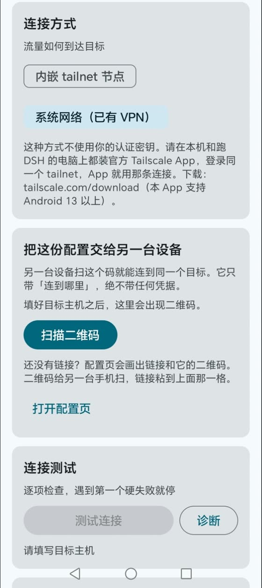 |
| **Android's own screen** — *Settings → Apps → DSH BYOK*, version **0.4.6**, installed by an installer | **First thing in the app** — the prerequisite card and **Tailscale 下载来源**, with the package-server APKs | **Connection method**, the hand-off to another device, and the **connection test** |
| 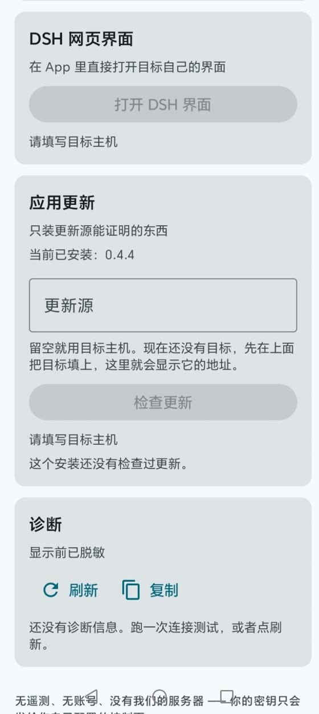 | 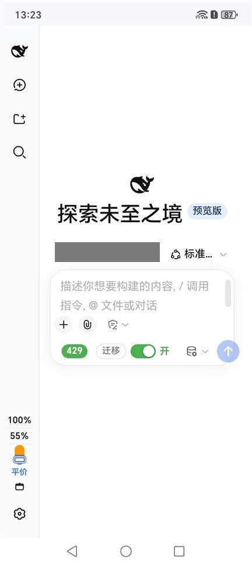 | 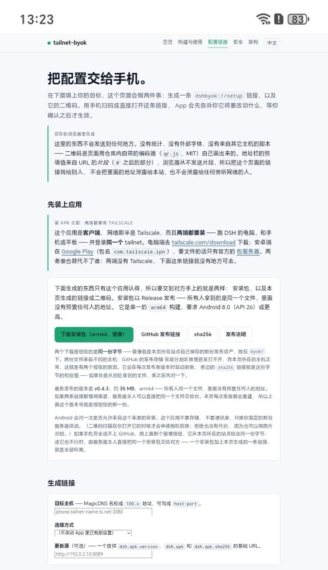 |
| The **DSH UI** button, the manual **update check**, and **diagnostics** last | **The DSH UI**, in the WebView, through the loopback proxy | **The provisioning page** that turns a target into a link or a code (address redacted) |

## First run, step by step

1. **Tailscale, on both ends.** Install the official Tailscale app on the phone or tablet *and* on
   the computer that runs DSH, and sign both into the same tailnet. The first card on the setup
   screen links to it (and to Tailscale's package server for the APK, for networks where Google Play
   and `tailscale.com` will not load).
2. **Get a configuration in.** On the computer, the provisioning page turns a target into a
   `dshbyok://setup` link and a QR code. Scan it, paste it, or type the host by hand — the app shows
   what a link would change and waits for a tap before applying anything.
3. **Pick a connection method.** *Embedded tailnet node* dials from inside the app with your own
   Tailscale auth key ("BYOK"); *System network* uses the tunnel the official app already
   established, and needs no key. Either works; the second is the everyday one.
4. **Run the connection test.** Six named steps, each with a duration, stopping at the first hard
   failure — so a failure says *which* part broke, not just "failed".
5. **Open the DSH UI.** The target's own interface, in the app, through a loopback-only proxy.
6. **Updates are manual, on purpose.** *Check for updates* runs when you tap it, and installs only
   bytes whose SHA-256 and declared package name both match.
7. **Diagnostics sit at the bottom.** Provider, node state, redacted target, last update result, and
   the node's recent log lines — short enough to paste into a bug report.

The setup screen is one scrollable screen, in this order: target → connection
method → credential → node → test. That order is the dependency order, so the
result of the test sits directly under the fields it describes.

### On a tablet

The same app on an Android tablet (HUAWEI AGS5-W00, Android 12), which is the other
half of the point: the DSH UI is the same page at a wider width, and the app around it
behaves the same. The tablet runs the **same release as the phone — 0.4.6** — and Android's
own app-info screen above is the proof of it; the captures here are from the 0.4.x line as
it grew. The block over the composer's workspace chip is a redaction — the name under it is
the local checkout's folder, and a machine path has no business in a public repository.

| | | |
|---|---|---|
| 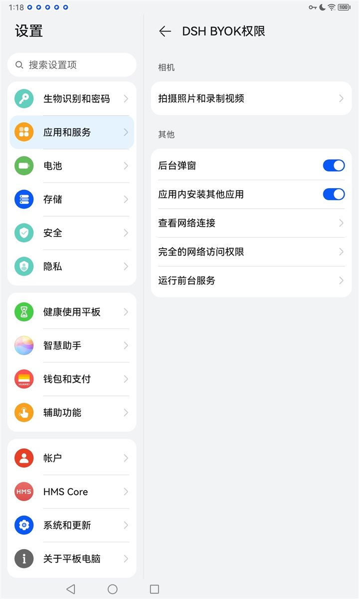 | 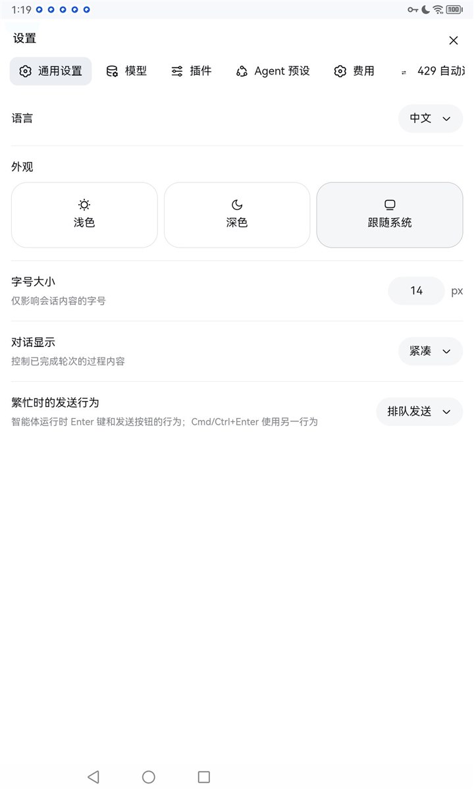 | 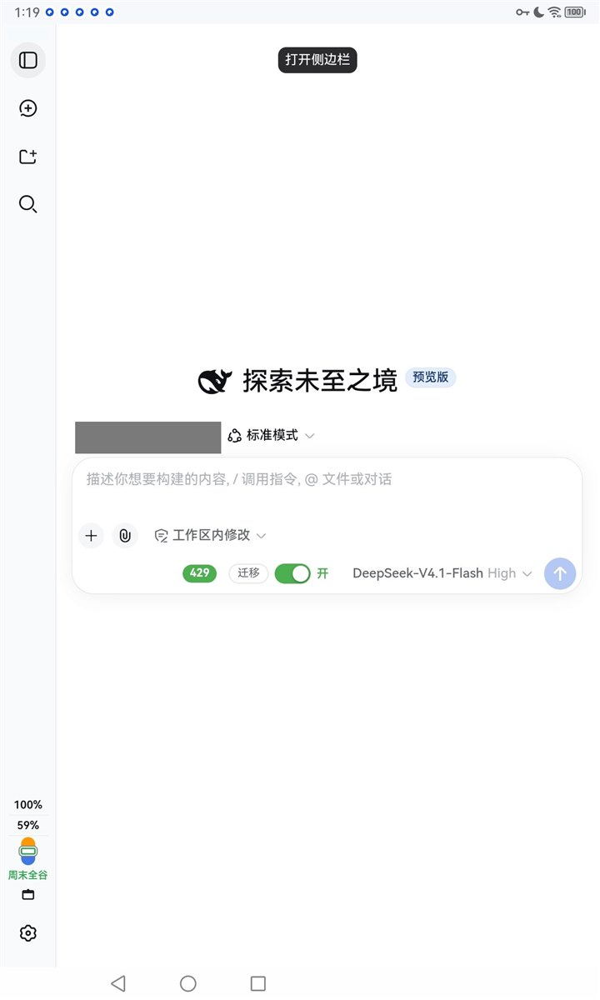 |
| **Permissions** — camera for a setup QR, install-unknown-apps for the updater | **DSH's settings**, tabbed, at tablet width | **The DSH UI** on the tablet (workspace name redacted) |
| 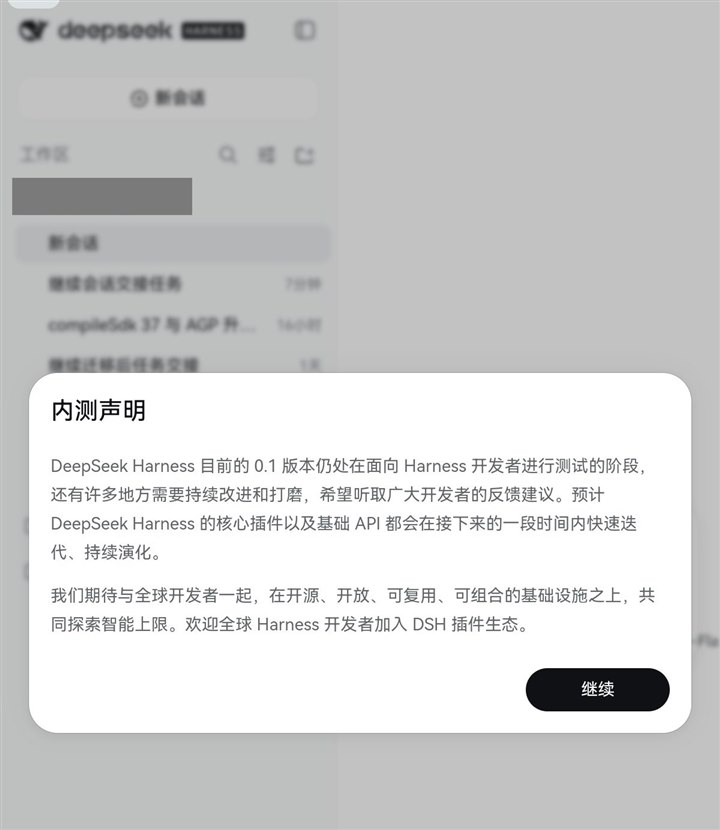 | 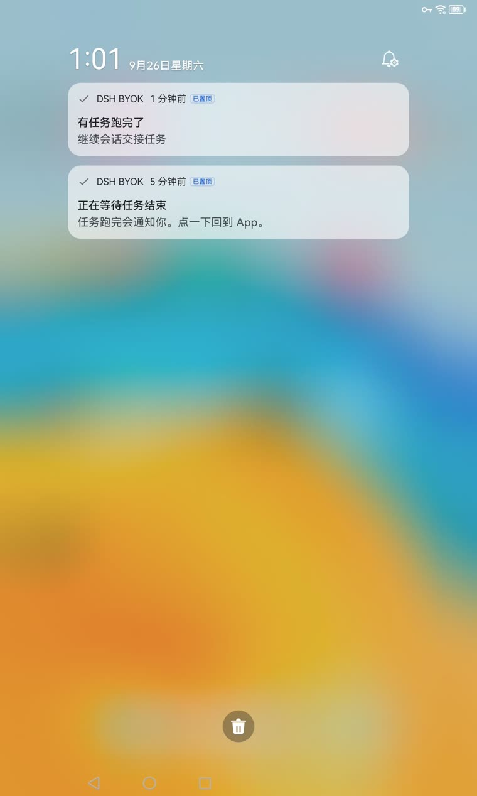 | 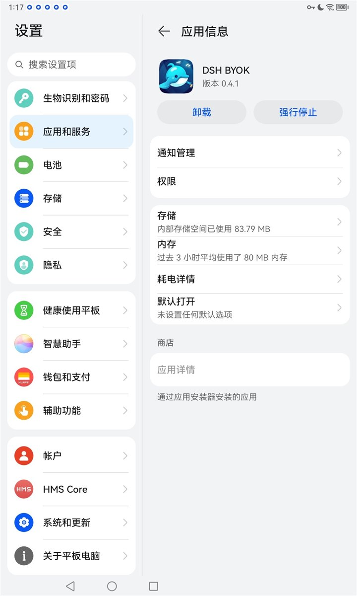 |
| **First run** on the tablet, over the session list | **The finish notice** on the tablet's own shade — and above it, the watch that precedes it | **Installed** — kept for the history: this is what the tablet looked like on 0.4.1 |

From there, *Open the DSH UI* swaps in `WebScreen.kt`: a WebView onto the
target's own interface, reached through the loopback proxy described above.

`SetupScreen.kt` ships three `@Preview`s (empty, passed, rejected address), so
the states are reviewable in the IDE without a device.

---

## Quick start

```bash
git clone https://github.com/zero6689/tailnet-byok.git
cd tailnet-byok
./gradlew assembleDebug          # Windows: .\gradlew.bat assembleDebug
```

That builds the app **without** the embedded node — the pure-Kotlin path, which
needs only JDK 17 and an Android SDK. The app still runs; it will tell you the
embedded provider is not compiled in and offer the system-network fallback.

To get the real thing, build the native bridge first, then rebuild:

```bash
./scripts/build-tailnet-aar.sh   # needs Go, gomobile and the Android NDK
./gradlew assembleDebug -PwithTsnet=true
```

Full details, including the Windows script and the exact toolchain versions, are
in [`docs/BUILD.md`](docs/BUILD.md) and [`docs/TSNET.md`](docs/TSNET.md).

---

## Architecture

```
                 ui/setup            Compose screen + view model
                     │
              domain/ConnectionTester      the six-step test
              domain/TailnetAddressPolicy  what may be dialled, and why not
                     │
              net/ConnectivityProvider     ← the seam
                   ╱        ╲
   net/SystemNetworkProvider   net/tsnet/TsnetConnectivityProvider
        (plain sockets)          (embedded node, gomobile bridge)
                                        │
                                tailnet/tailnet.go   (Go, tsnet)
```

The seam that matters is `ConnectivityProvider`. The UI never branches on which
implementation is active, which is what makes the embedded node optional and a
third provider a local change.

There is no Hilt, no Retrofit, no Room, and no navigation library. Four objects
are wired by hand in `di/AppContainer.kt`, with the reasoning for each omission
written down in [`docs/ARCHITECTURE.md`](docs/ARCHITECTURE.md).

### Why the HTTP happens in Go

A Go `net.Conn` cannot be represented in Java, so no JNI bridge can hand a socket
across. The app therefore does its HTTP *inside* Go — through the tailnet's own
network stack — and passes the response back as JSON with a base64 body. That is
why `ConnectivityProvider.fetch()` returns bytes rather than a socket, and it is
not an accident of the implementation.

---

## Security

| Requirement | How it is met |
|---|---|
| Never hardcode private configuration | No credential exists in the source, the build, or `BuildConfig`. The only `buildConfigField` is a non-secret control-plane URL. |
| Key never written to disk in plain text | AES-256-GCM via the Android Keystore, `setRandomizedEncryptionRequired(true)`, `setUnlockedDeviceRequired(true)` on API 28+. The node's own state lives in `noBackupFilesDir`. |
| Key never written to logs | All logging goes through `SafeLog`, which scrubs through `Redact`; release builds strip `v`/`d`/`i` at the bytecode level. `RedactTest` covers the credential shapes this project actually handles. |
| No accidental egress | `TailnetAddressPolicy` rejects anything outside `100.64.0.0/10`, `fd7a:115c:a1e0::/48` and named hosts **before** a dial. |
| Nothing leaves the device | `android:allowBackup="false"`, backup and device-transfer rules exclude everything, no analytics, no crash reporter, no server. |
| Minimum permissions | `INTERNET`, `ACCESS_NETWORK_STATE`, `POST_NOTIFICATIONS`, `REQUEST_INSTALL_PACKAGES` (the updater asks the system installer — it cannot install silently), `CAMERA` (the QR scanner screen only, and optional: a code can be read from a picture instead), `FOREGROUND_SERVICE` (raised only while the DSH screen is open, so a task you started can be noticed finishing while the app is off screen — Android freezes backgrounded apps, which used to stop that check silently). No `BIND_VPN_SERVICE`. No `QUERY_ALL_PACKAGES`. No location. |
| Updates are verified or refused | The updater downloads `dsh.apk` only after `dsh.apk.version` advertises something newer, and installs it only if its SHA-256 matches `dsh.apk.sha256` and the archive declares this app's package name. A missing or mismatched sidecar is a failure, never a silent pass. |

The honest limits of all of this — what Keystore does *not* protect against, and
why the plaintext key exists in the heap for a short window — are in
[`docs/SECURITY-MODEL.md`](docs/SECURITY-MODEL.md). Read it before you trust the
app with a key that can join a machine to your tailnet.

**Found a vulnerability?** Please do not open a public issue. See
[`SECURITY.md`](SECURITY.md).

---

## Privacy

No telemetry, no analytics, no crash reporting, no account, no server. The app's
own network traffic consists of exactly two things: the control-plane connection
that its Tailscale node makes, and the requests you ask it to make. Full text:
[`PRIVACY.md`](PRIVACY.md).

---

## Documentation

| | |
|---|---|
| [docs/BUILD.md](docs/BUILD.md) | Build the app, and the native bridge |
| [docs/RELEASING.md](docs/RELEASING.md) | What a release records, and what must be true first |
| [docs/DEPENDENCIES.md](docs/DEPENDENCIES.md) | How the graph is pinned, and what moving it costs |
| [docs/TSNET.md](docs/TSNET.md) | How the embedded node works, and the traps |
| [docs/PROVISIONING.md](docs/PROVISIONING.md) | Configuration links, QR codes, and pre-filled builds |
| [docs/ARCHITECTURE.md](docs/ARCHITECTURE.md) | Module layout and the decisions behind it |
| [docs/SECURITY-MODEL.md](docs/SECURITY-MODEL.md) | Threat model, in plain language |
| [docs/PROVENANCE.md](docs/PROVENANCE.md) | Where the code came from, and how that was checked |
| [THIRD-PARTY-NOTICES.md](THIRD-PARTY-NOTICES.md) | Every module linked into the native library |
| [tailnet/README.md](tailnet/README.md) | The Go bridge, and its binding rules |
| [Website](https://zero6689.github.io/tailnet-byok/) | The same docs, rendered |

---

## Status

Version **0.4.6** (`versionCode` 26) — running on a phone *and* a tablet, and it compiles.

**Verified by an actual build**, not by inspection: **178 unit tests pass** (no failures, no
skips), Lint reports **zero errors** (five warnings), and the release workflow builds and signs the
`arm64-v8a` asset; the gomobile bridge produces a 60.0 MiB `tailnet.aar`.

The release ships **one ABI, not four**: an `arm64-v8a` APK of about **35 MiB** (35.1 MiB for the
v0.4.6 asset — 36,874,060 B, measured by downloading it), built with R8 off so that the code which ships is the
code the tests cover. A workstation build of the same commit measures ~54 MiB, for two reasons: the
release workflow puts the NDK on `ANDROID_NDK_HOME` so AGP strips the native library's debug tables
(~9 MB of `.debug_*`, `.symtab` and `.strtab`), and the locally bound `libgojni.so` carries about
11 MB more DWARF to begin with. Stripping removes debug and static symbol tables only: `.text`,
`.rodata` and `.gopclntab` come out the same size and the dynamic symbol table is identical, all 28
`Java_io_github_*` entry points included. Four ABIs of `libgojni.so` are 162.4 MiB on their own,
which is the whole argument for shipping one.

| Artifact | Size |
|---|---|
| `tailnet.aar` | 60.0 MiB |
| Release APK, `arm64-v8a` only — the asset the release serves, R8 off | 35.1 MiB |
| Release APK, `arm64-v8a` only, built on this workstation, R8 off | 54.2 MiB |
| Release APK, four ABIs, R8 on | 164.1 MiB |

> **The embedded node is essentially the whole app.** Four ABIs of `libgojni.so` total 162.4 MiB
> against a 164.1 MiB release APK. If you need more than `arm64-v8a`, build it with
> `-PabiFilters=`, ship an App Bundle, or use the `SYSTEM_NETWORK` provider and let the official
> Tailscale app own the tunnel. Details in
> [docs/TSNET.md](docs/TSNET.md#measured-sizes).

Sizes are MiB, measured on the build described in that document; they move when
`tailscale.com` moves, which is why they are stated with the version that produced them.

**Embedded at build time:** `tailscale.com v1.102.4`, resolved by `go mod tidy` and committed
in `tailnet/go.mod` + `go.sum`.

Not yet done, and listed honestly rather than discovered by you: there are no instrumented
tests, so nothing has run on a device in CI (the app itself is used on a phone by hand); every
user-facing string is extracted and the app ships an English and a Chinese translation, but no
third locale; and nothing in this repository is a screenshot from a running app. See
`docs/ARCHITECTURE.md → Known gaps`.

### Known gaps

- **It is a client and nothing else.** One target at a time, no LAN-only mode, no public relay, no
  plugin inside DSH — and it cannot reach a DSH that your tailnet cannot already reach.
- **The interface is DSH's own**, so how it renders is decided by the WebView it lands on. On old
  engines (the tablet used here runs Chromium 92) that page needs compatibility help, and that help
  belongs to the deployment, not to this APK — a client cannot fix a missing JS built-in, a class
  static block, or a `vh`-sized overlay from the outside.
- **The connection is only as steady as the tunnel.** Screen-off, Doze, or the official Tailscale app
  being stopped can drop the socket; the page then offers a reconnect, and tapping it is on you.
- **The update check is manual and refuses to guess.** No timer, no background check, and it installs
  only bytes whose SHA-256 *and* declared package name both match.
- **One ABI, one platform.** `arm64-v8a` only, Android 8 or later; there is no iOS client.
- **The embedded node is optional and needs your own auth key.** It is not the day-to-day path, and it
  is a mode in the build rather than a service.

### What the deployment adds on the DSH side (none of it is in this APK)

Getting DSH into a hand needed work on the *served page* as well, and it lives outside this repository:

- **a door in front of DSH** on the tailnet, so the address the app is handed is not DSH's own port;
- **early polyfills** for the JS built-ins old WebViews lack (`Object.hasOwn`, `findLast`,
  `reportError`, `AbortSignal.throwIfAborted`, `at()`, …), injected into the page;
- a **viewport-unit guard** that rewrites `vh` / `dvh` in the page's own stylesheets to a trusted pixel
  height, because a layout viewport of 0 collapses cards and overlay menus to a slit;
- an **engine diagnostics beacon** that reports the WebView engine, which built-ins are missing, and the
  last console errors — that beacon is how the two problems above were found at all;
- a **legacy-syntax downgrade** for class static blocks, which on an old parser aborts the whole bundle
  before React ever mounts.

Every one of these patches a *served page*, so each has to be re-applied after a `dsh web` upgrade, and
none of it is upstream. That is the honest cost of supporting old devices.

### What building it taught us

Four things in the original skeleton were wrong, and only a real build could find them. Each
one produces an error message that points somewhere other than the cause:

| Trap | Where it bites |
|---|---|
| `-javapkg` is a prefix, not a package | The AAR builds; Kotlin reports a hundred unresolved references |
| gomobile binds Go `int` as Java `long` | "actual type is Int, but Long was expected" |
| gomobile copies Go doc comments into Java, and javac uses the platform charset | `unmappable character` errors in a file nobody wrote |
| `gomobile bind` must run from inside the Go module | "requires golang.org/x/mobile in the current module" — when it is |

All four are written up in [docs/TSNET.md](docs/TSNET.md#traps-found-by-actually-building-it).

---

## Contributing

Issues and pull requests are welcome. Before opening a PR, please read
[`CONTRIBUTING.md`](CONTRIBUTING.md) — in particular the rule that **no test,
fixture, log line or commit message may contain a real auth key**, and the
requirement that security-relevant changes come with a note in
`docs/SECURITY-MODEL.md`.

## Not affiliated with DeepSeek

The app's display name is **"DSH BYOK"** — `DSH` for DeepSeek Harness, the thing this app is a
client for, and `BYOK` for the bring-your-own-key model it is built around. The full name
**"DeepSeek Harness"** appears in this project only inside descriptive sentences such as "an
independent client that works with DeepSeek Harness". That is the form DeepSeek's own brand
guidelines ask third-party projects to use: they suggest the abbreviation `DSH` as a project name,
and single out using the full mark as one.

**DeepSeek and the DeepSeek whale are trademarks of their respective owner. This project is
an independent, unofficial client. It is not affiliated with, endorsed by, sponsored by, or
in any way officially connected to DeepSeek.**

The source code is licensed under MIT (see [LICENSE](LICENSE)). **That licence covers the
code only.** It grants no rights to any name, logo or trademark: copyright and trademark are
separate questions, and MIT is silent on the second one. Anyone redistributing this project —
a fork, a rebuild, a store listing — inherits the same position and should carry the same
disclaimer.

The launcher icon is this project's own composition — a blue whale holding a glowing phone, two
signal arcs above it, on a dark blue plate — but the whale is DeepSeek's brand character, so the
mark is used descriptively under the disclaimer above rather than licensed. What that does and does
not buy is written out in [`branding/README.md`](branding/README.md), including what a mark with no
third-party character in it would cost.

If you are the rights holder and would prefer the name or the artwork changed, please open an
issue and it will be changed.

## License

[MIT](LICENSE). Use it, fork it, ship it — subject to the note above about marks.

The embedded node is [`tailscale.com/tsnet`](https://pkg.go.dev/tailscale.com/tsnet),
which is BSD-3-Clause. This project is not affiliated with Tailscale Inc.
"Tailscale" is their trademark; this app is an independent client for their
protocol and for headscale.

The native library statically links a few dozen Go modules, and BSD-3-Clause and
Apache-2.0 both attach conditions to *binary* distribution — the copyright notice,
the list of conditions and the disclaimer have to travel with the binary. Those
obligations are met in [`THIRD-PARTY-NOTICES.md`](THIRD-PARTY-NOTICES.md), with the
full licence text in [`licenses/`](licenses/). Neither file is maintained by hand:
`scripts/third-party-licenses.mjs` regenerates them from `go list -deps`, so they
describe what is actually in the binary rather than what someone remembered to add.

Where the code came from — and how that was checked — is
[`docs/PROVENANCE.md`](docs/PROVENANCE.md).
